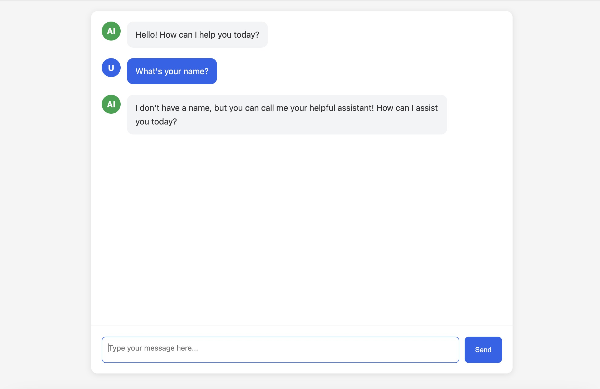

# Hono + Bun + OpenAI Chat Example

A real-time AI chat example that leverages Server-Sent Events (SSE) to stream responses from OpenAI's API. Built with Hono framework and powered by Bun runtime.

## Features

- 🚀 Real-time streaming responses using Server-Sent Events (SSE)
- ⚡️ High-performance backend powered by Bun runtime
- 🔄 Seamless integration with OpenAI API
- 🛠️ Built with Hono - a lightweight, ultrafast web framework
- 📱 Modern and responsive chat interface

## Screenshots



## Prerequisites

Before you begin, ensure you have the following installed:
- [Bun](https://bun.sh) (latest version)
- An OpenAI API key

## Usage

```bash
bun install
```

Create a `.env` file in the project root and add your OpenAI API key:

```env
OPENAI_BASE_URL=openai_base_url
OPENAI_API_KEY=your_api_key_here
```

```bash
bun run dev
```

Open your browser and navigate to `http://localhost:3000`

## Project Structure

```
project-root/
├── src/
│   └── index.ts        # Entry point
├── index.html          # Website template
└── package.json
```

## API Endpoints

### POST /chat
Initiates a chat session with the AI model.

#### Request

```json
{
  "prompt": "Your prompt here"
}
```

#### Response

Server-Sent Events stream with AI responses.

## Acknowledgments

- [Hono](https://hono.dev) - The ultrafast web framework
- [Bun](https://bun.sh) - The fast all-in-one JavaScript runtime
- [OpenAI](https://openai.com) - For providing the AI capabilities
